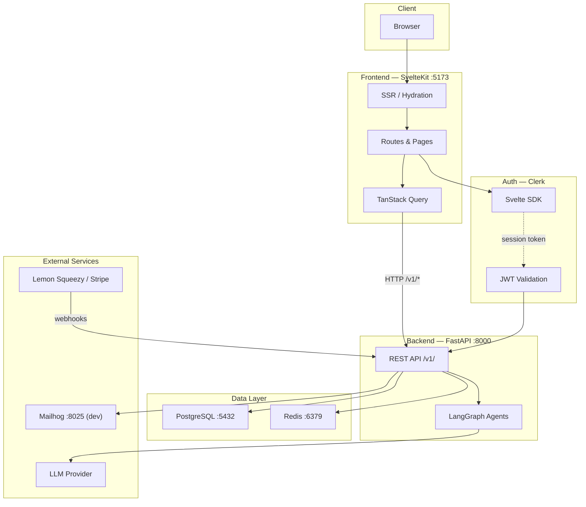
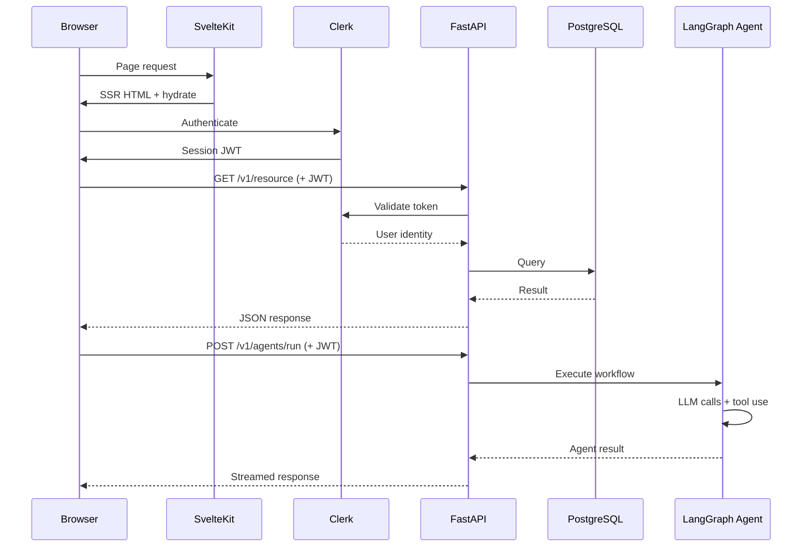
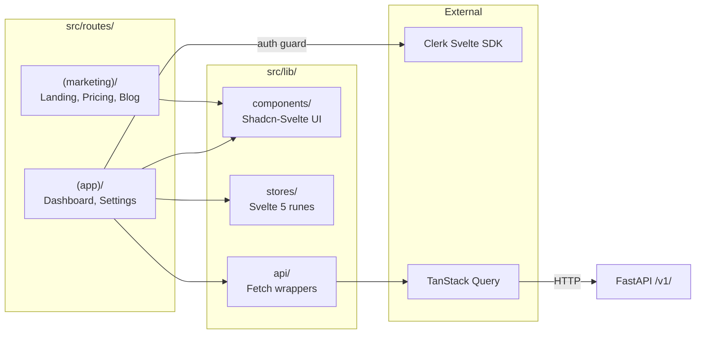
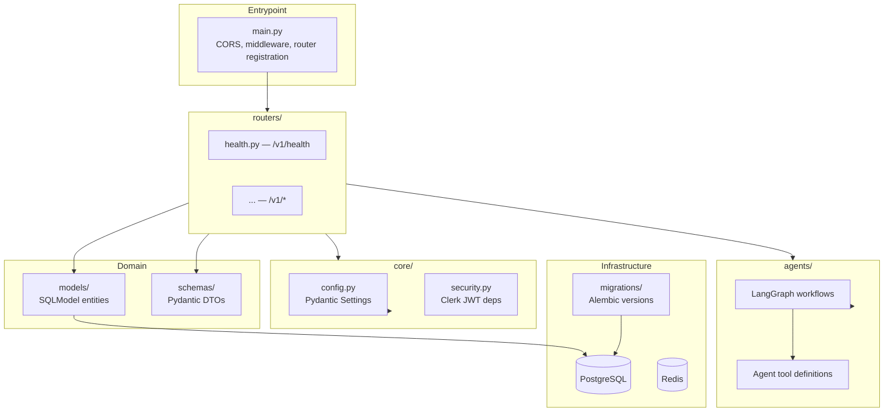
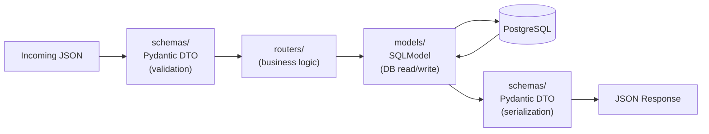

# Micro-SaaS Starter

A full-stack boilerplate for building SaaS products with AI agent capabilities. SvelteKit frontend, FastAPI backend, LangGraph AI workflows.

## Architecture

### System Overview



### Request Flow



### Frontend Architecture



### Backend Architecture



### Data Model Separation



## Quick Start

```bash
# Start infrastructure (Postgres, Redis, Mailhog)
docker compose up -d

# Backend
cd backend
uv sync
uv run fastapi dev app/main.py

# Frontend (in another terminal)
cd frontend
npm install
npm run dev
```

## Tech Stack

| Layer | Technology | Purpose |
|-------|-----------|---------|
| Frontend | SvelteKit + Svelte 5 | App framework with runes reactivity |
| UI | Shadcn-Svelte + Tailwind CSS | Components and styling |
| Data Fetching | TanStack Query | Caching and optimistic updates |
| Backend | FastAPI + UV | Async API server |
| ORM | SQLModel | Type-safe models (Pydantic + SQLAlchemy) |
| Migrations | Alembic | Database schema versioning |
| AI | LangGraph | Stateful AI agent workflows |
| Auth | Clerk | Authentication and multi-tenancy |
| Payments | Lemon Squeezy / Stripe | Billing and subscriptions |
| Infra | Docker + Railway | Local dev and deployment |

## Project Structure

```
.
├── frontend/              # SvelteKit app
│   └── src/
│       ├── lib/           # Components, stores, API clients
│       └── routes/        # (app)/ for dashboard, (marketing)/ for public pages
│
├── backend/               # FastAPI app
│   ├── app/
│   │   ├── routers/       # API endpoints (versioned under /v1/)
│   │   ├── agents/        # LangGraph AI workflows
│   │   ├── core/          # Config, security, utils
│   │   ├── models/        # SQLModel database entities
│   │   └── schemas/       # Pydantic request/response DTOs
│   └── migrations/        # Alembic migration history
│
├── docs/                  # Project documentation
└── docker-compose.yml     # Local dev services
```

## Development

### Frontend

```bash
cd frontend
npm run dev       # Dev server at localhost:5173
npm run build     # Production build
npm run check     # Type checking
npm run lint      # Lint + format check
```

### Backend

```bash
cd backend
uv run fastapi dev app/main.py                  # Dev server at localhost:8000
uv run pytest                                   # Run all tests
uv run pytest tests/test_foo.py::test_bar       # Run single test
uv run alembic upgrade head                     # Apply migrations
uv run alembic revision --autogenerate -m "description"  # New migration
```

### Infrastructure

```bash
docker compose up -d     # Start Postgres, Redis, Mailhog
docker compose down      # Stop services
```

See [docs/setup.md](docs/setup.md) for detailed environment configuration.
